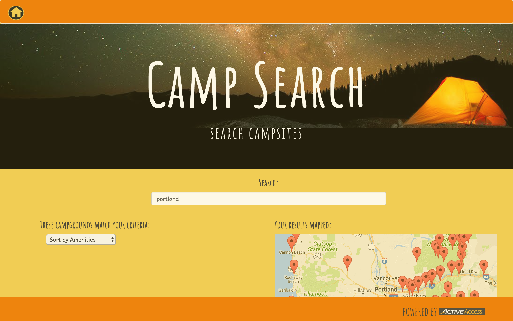

# Campsearch

Campsearch displays campgrounds in a user specified location using Google Map and lists campground details on click. It sorts campgrounds according to pet friendliness and waterfront access.

#### Stretch Goals
  * add email and password user authentication
  * add reviews to specific campground-list
  * user profile and karma rating
  * add dispensaries
  * add hot springs
  * weather API

## Prerequisites

API keys:
  * Active Access http://developer.active.com/member/register
  * Firebase https://firebase.google.com/
  * Google Map https://developers.google.com/maps/documentation/javascript/get-api-key

Proper installation of:
  * Git
  * Node.js
  * Typescript
  * Angular2
  * Google Chrome extension https://chrome.google.com/webstore/detail/allow-control-allow-origi/nlfbmbojpeacfghkpbjhddihlkkiljbi

## Installation
Enable cross-origin resource sharing in Chrome extension
In terminal:
  * `git clone https://github.com/callmedw/campgroundSearch`
  * `cd campgroundSearch`
  * `nmp install`
  * Open project in text editor and save your api keys in the `api-keys-template.ts` file noting instructions for protecting API keys.
  * run `ng serve` to start development server and navigate to `http://localhost:4200/`

## Authors
Dana Weiss, Tyler the Viking Stephenson, Susha Dore

## License
MIT License

